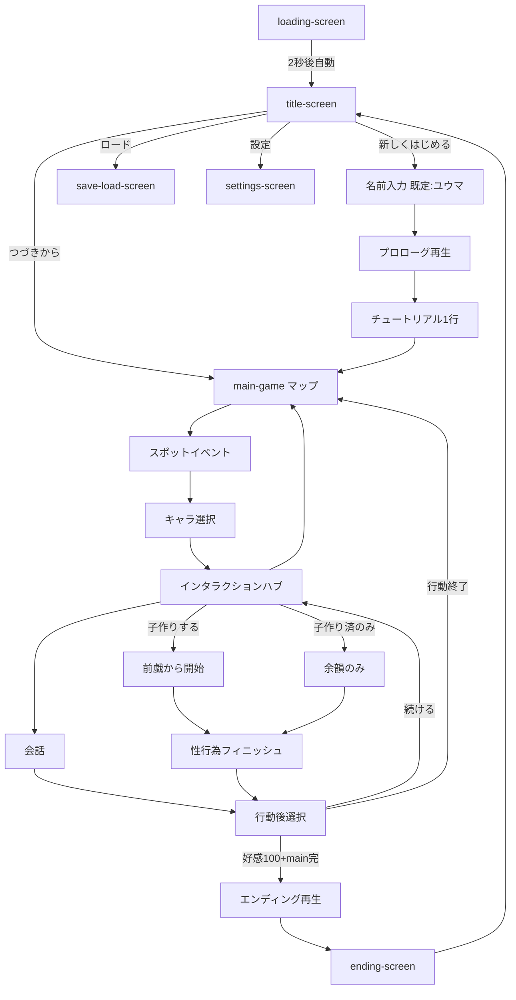
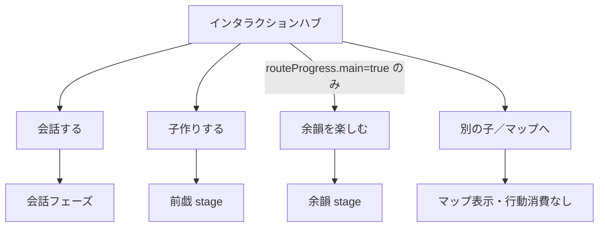
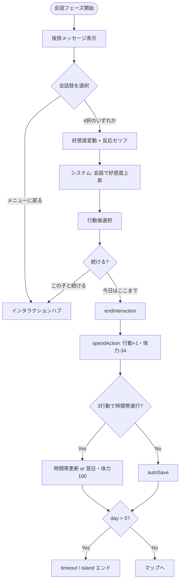
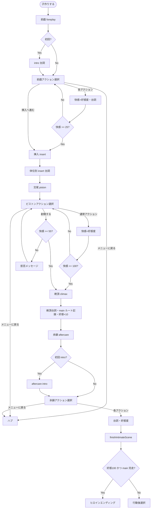
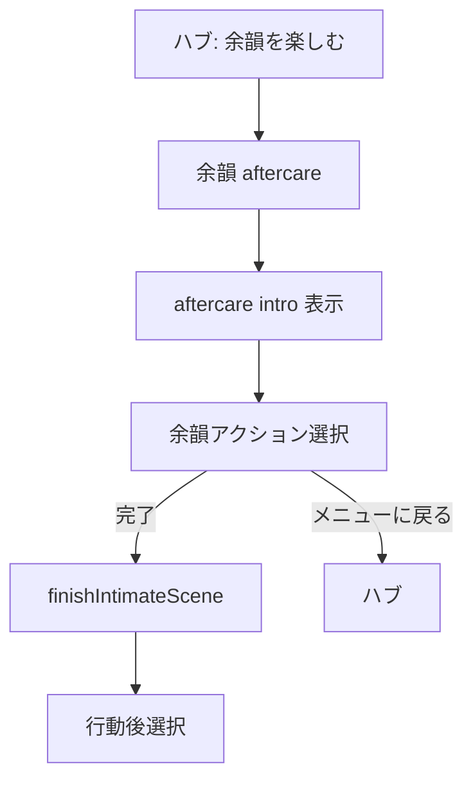
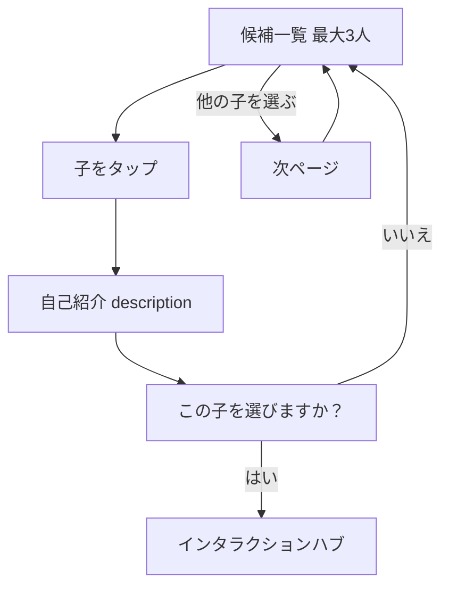

# 泡児島ノベルゲーム — 画面設計書

**版**: 2.0（実装準拠）  
**対象**: `002_泡児島/ブラウザノベルゲーム`  
**更新日**: 2026-05-19

---

## 1. 画面一覧と遷移

| # | 画面ID | 画面名 | 種別 |
|---|--------|--------|------|
| 1 | `loading-screen` | ローディング | フルスクリーン |
| 2 | `title-screen` | タイトル | フルスクリーン |
| 3 | `main-game` | メインゲーム | フルスクリーン（複数サブUI） |
| 4 | `save-load-screen` | セーブ／ロード | モーダル |
| 5 | `settings-screen` | 設定 | モーダル |
| 6 | `character-detail-screen` | キャラ詳細 | モーダル（HTML定義・未配線） |
| 7 | `affection-status-screen` | 好感度一覧 | モーダル |
| 8 | `game-menu-screen` | ゲームメニュー | モーダル |
| 9 | `message-log-screen` | メッセージログ | モーダル |
| 10 | `ending-screen` | エンディング | オーバーレイ |

### メインゲーム内サブUI（`main-game` 上に重ね表示）

| サブUI ID | 名称 |
|-----------|------|
| `background-image` | 背景 |
| `character-image` | 立ち絵 |
| `affection-hud` | 好感度HUD |
| `affection-toast` | 好感度変動トースト |
| `intimate-hud` | 性行為シーンHUD |
| `top-ui` | 上部ステータス・ボタン |
| `map-container` | 島内マップ |
| `message-window` | メッセージウィンドウ |
| `choices-container` | 選択肢 |

### 画面遷移図（概要）



---

## 1.1 ゲームプレイフロー（会話・性行為）

### インタラクションハブ → 分岐



### 会話フロー（ループ・終了条件）



**会話のフィニッシュ条件**

| 条件 | 結果 |
|------|------|
| 会話肢を1回選択 | 行動後選択へ（必ず1回分の活動として消費候補） |
| 「今日はここまで」 | `endInteraction` → 行動消費・マップ |
| 「この子と続ける」 | ハブへ戻る（行動消費なし） |

---

### 性行為フロー（5段階・ループ・フィニッシュ）



### 余韻のみ（子作り済みキャラ限定）



**性行為のフィニッシュ条件**

| 段階 | ループ終了条件 | 次へ |
|------|----------------|------|
| 前戯 | 快感≥25（自動）または「挿入へ進む」 | insert |
| 交尾 | 快感≥100（自動）または「射精する」かつ快感≥55 | climax |
| 絶頂 | 台詞再生後（自動） | aftercare |
| 余韻 | いずれかの余韻アクション選択 | `finishIntimateScene` |
| 全体 | `finishIntimateScene` | 行動後選択 or ヒロインED |

**行動後選択（会話・性行為共通）**

| 選択肢 | 行動消費 | 遷移 |
|--------|----------|------|
| この子と続ける（メニューへ） | なし | ハブ |
| 今日はここまで（行動終了） | あり（`spendAction`） | マップ |

**エンディング到達（性行為後）**

- `好感度 >= 100` **かつ** `routeProgress[キャラ].main === true` → ヒロインエンディング再生

---

## 2. グローバル操作（全画面共通）

| 操作 | 条件 | イベント／処理 |
|------|------|----------------|
| **Enter / Space** | メインゲーム・メッセージ表示中 | `advanceMessage()` → タイピング完了 or シナリオ進行 or フェーズ進行 |
| **Escape** | `main-game` | `showMenu()` → ゲームメニュー表示 |
| **Escape** | モーダル表示中 | `closeModal()` |
| **Ctrl+S** | メインゲーム | `quickSave()` → localStorage |
| **Ctrl+L** | メインゲーム | `quickLoad()` → 復元 |
| **モーダル背景クリック** | モーダル | `closeModal()` |

### 初期化シーケンス

| 順 | イベント | 処理 |
|----|----------|------|
| 1 | `DOMContentLoaded` | `storyManager.initializeScenarios()` |
| 2 | | `uiManager.initialize()` → 2秒後 `showTitleScreen()` |
| 3 | | `gameEngine.initialize()` |

---

## 3. 各画面詳細

---

### 3.1 ローディング画面（`loading-screen`）

**目的**: 起動時の読み込み表示。

#### 表示項目

| 要素ID | 種別 | 内容 |
|--------|------|------|
| `.game-title` | テキスト | 泡児島 |
| `.game-subtitle` | テキスト | 〜楽園での出会い〜 |
| `.loading-spinner` | アニメ | スピナー |
| `.loading-text` | テキスト | ゲームを読み込んでいます... |

#### イベント

| トリガー | イベント名 | 遷移先／副作用 |
|----------|------------|----------------|
| 初期化完了（2秒タイマー） | `showTitleScreen` | `title-screen` |

---

### 3.2 タイトル画面（`title-screen`）

**目的**: ゲーム開始・継続・設定の入口。

#### 表示項目

| 要素ID | 種別 | 内容 |
|--------|------|------|
| `.game-title` | テキスト | 泡児島 |
| `.game-subtitle` | テキスト | 〜楽園での出会い〜 |
| `new-game-btn` | ボタン | 新しくはじめる |
| `continue-game-btn` | ボタン | つづきから |
| `load-game-btn` | ボタン | ロード |
| `title-settings-btn` | ボタン | 設定 |

#### イベント

| トリガー | イベント名 | 処理 | 遷移先 |
|----------|------------|------|--------|
| `new-game-btn` クリック | `startNewGame` | `promptPlayerName()` で名前入力 → `gameState` 初期化（既定: `ユウマ`、最大8文字） → `playPrologue()` | `name-input-screen` → `main-game`（プロローグ中はマップ非表示） |
| `continue-game-btn` クリック | `continueGame` | `loadAutoSave()` → `migrateGameState()` | `main-game` マップ |
| `load-game-btn` クリック | `showLoadScreen` | スロット一覧生成 | `save-load-screen`（ロードモード） |
| `title-settings-btn` クリック | `showSettingsScreen` | 設定読込 | `settings-screen` |

**つづきから失敗時**: アラート「継続データが見つかりません」。

---

### 3.2.1 名前入力画面（`name-input-screen`）

**目的**: 新規ゲーム開始時にプレイヤー名を取得し、ゲーム中の台詞に反映。

#### 表示項目

| 要素ID | 種別 | 内容 |
|--------|------|------|
| `name-input-screen` | モーダル | 「あなたのお名前は？」 |
| `player-name-input` | text input | placeholder=ユウマ・maxlength=8 |
| `player-name-confirm-btn` | ボタン | この名前で始める |

#### イベント

| トリガー | イベント名 | 処理 |
|----------|------------|------|
| `player-name-confirm-btn` クリック / Enter | `promptPlayerName` 解決 | `normalizePlayerName` → 空白なら「ユウマ」・8文字切詰 |

#### 置換ルール（`UIMessageHelpers.applyPlayerName`）

| 元トークン | 置換結果 |
|-----------|---------|
| `${playerName}` | プレイヤー名 |
| `{playerName}` | プレイヤー名 |
| `{あなた}` | プレイヤー名 |

`uiManager.showMessage` 時に常時適用。プロローグ・会話台本・シナリオ JSON すべてで使える。

---

### 3.3 メインゲーム画面（`main-game`）

**目的**: 探索・会話・性行為の本体。背景・立ち絵・HUD・マップ・メッセージを重ねる。

---

#### 3.3.1 上部UI（`top-ui`）

##### 表示項目（`game-info`）

| 要素 | データソース | 表示例 |
|------|--------------|--------|
| `.current-spot` | `gameState.currentSpot` | ターミナル |
| `.time-display` | `gameState.timeOfDay` | 朝／昼／夕方／夜 |
| `#day-display` | `gameState.day` | 3日目 / 5日 |
| `#energy-display` | `gameState.energy` | 体力 66 |
| `#actions-display` | `gameState.actionsToday` | 行動 1/3 |

##### 表示項目（`ui-controls`）

| 要素ID | ラベル |
|--------|--------|
| `menu-button` | メニュー |
| `save-button` | セーブ |
| `load-button` | ロード |
| `settings-button` | 設定 |

##### イベント

| トリガー | イベント名 | 遷移先 |
|----------|------------|--------|
| `menu-button` | `showMenu` | `game-menu-screen` |
| `save-button` | `showSaveScreen` | `save-load-screen`（セーブ） |
| `load-button` | `showLoadScreen` | `save-load-screen`（ロード） |
| `settings-button` | `showSettingsScreen` | `settings-screen` |

---

#### 3.3.2 島内マップ（`map-container`）

**表示条件**: `showMap()` 時（探索フェーズ）。

##### 表示項目

| 要素 | 内容 |
|------|------|
| `.map-title` | 島内マップ |
| `.map-spot[data-spot]` ×6 | アイコン＋スポット名（下表） |

| data-spot | アイコン | 表示名 | コンセプト |
|-----------|----------|--------|------------|
| `port` | ⛴️ | 船着き場 | 到着・出迎え・送り出し |
| `inn` | 🏯 | 旅館「潮汐亭」 | 宿泊／食事／部屋イベント |
| `onsen` | ♨️ | 温泉「波音の湯」 | 入浴／湯上り |
| `observatory` | 🌅 | 展望台 | 夕日・告白・景色イベント |
| `beach` | 🏖️ | 砂浜 | 水着・野外プレイ枠 |
| `forest_shrine` | ⛩️ | 森の祠 | 静謐／隠しイベント |

旧 ID（terminal / beachbar / cottage / hotel / restaurant / library / garden / sports_area）は
`SPOT_ALIASES` で現行 ID に自動解決される（後方互換）。

##### イベント

| トリガー | イベント名 | 処理 | 次画面 |
|----------|------------|------|--------|
| `.map-spot` クリック | `selectSpot(spotId)` | `hideMap` → `changeSpot(spotId)` | スポットイベント（メッセージ→キャラ選択） |
| `flags.endingSeen` 時の移動 | — | メッセージ「物語は完結しました…」 | マップ維持 |
| 無効スポットID | — | メッセージ「このエリアにはまだ行けません」 | マップ |
| `showMap` 時（内部） | `checkForceEnding` | 6日目超過等でタイムアウト／島エンド | エンディング再生 |

---

#### 3.3.3 スポットイベント（マップ上の論理画面）

**トリガー**: `changeSpot` → `processSpotEvents`

##### 表示・メッセージイベント

| 条件 | 話者 | メッセージ概要 |
|------|------|----------------|
| `spotId === terminal` かつプロローグ済 | コンシェルジュ | チェックイン済み・マップへ誘導 |
| `spotId === terminal` かつ未プロローグ | コンシェルジュ | ロビー説明 |
| 遭遇キャラ0人・met0人 | システム | まだ誰とも会っていない |
| 遭遇キャラ0人・metあり | システム | 新規遭遇なし・会った子はどこでも可 |
| 遭遇キャラ≥1 | — | キャラ選択へ |

##### キャラ出現ルール（`getAvailableCharacters`）

| 区分 | 条件 |
|------|------|
| **常時呼び出し** | `metCharacters[id] === true` の全員（スポット不問） |
| **初遭遇のみ** | 未会かつ `preferredSpots` が現スポットと一致 |

**プロローグで met になる8人**: minagi, kokoa, hinata, sakura, aoi, miyu, rin, nagisa

##### キャラ選択（`showCharacterSelection` v2.1）

**表示**: 最大3人ずつ。2ページ以上あるとき「他の子を選ぶ」で循環切替。



| 選択肢 | イベント |
|--------|----------|
| キャラ名（★初対面タグ付き可） | `previewCharacterSelection` → 自己紹介 → 確認 |
| 他の子を選ぶ | `page+1`（循環） |
| はい、この子に決める | `confirmCharacterSelection` → `markMet` → ハブ |
| いいえ、別の子を見る | 一覧へ（met未登録のまま） |
| マップに戻る | `showMap()` |

---

#### 3.3.4 好感度HUD（`affection-hud`）

**表示条件**: キャラインタラクション中。

| 要素ID | 内容 |
|--------|------|
| `affection-hud-name` | キャラ名（ランク色） |
| `affection-hud-fill` | 好感度バー（幅＝%） |
| `affection-hud-text` | `値 (ランク名)` |

**イベント**: `changeAffection` 時に `showAffectionDelta` → `#affection-toast` に ±表示（1.8秒）。

---

#### 3.3.5 性行為シーンHUD（`intimate-hud`）

**表示条件**: `startIntimateScene` 中。

| 要素ID | 内容 |
|--------|------|
| `intimate-stage-label` | 前戯／挿入／交尾／絶頂／余韻 |
| `intimate-position-label` | 正常位／騎乗位 |
| `intimate-pleasure-fill` | 快感ゲージ（0–100%） |
| `intimate-pleasure-text` | 快感 N% |
| `intimate-log` | 直近8件の台詞ログ |

---

#### 3.3.6 メッセージウィンドウ（`message-window`）

| 要素ID | 内容 |
|--------|------|
| `speaker-name` | 話者名（空＝ナレーション） |
| `message-text` | 本文（タイプライター表示） |
| `message-hint` | クリック / Enter で進む |
| `auto-btn` | オート／オート停止 |
| `skip-btn` | スキップ ON/OFF・高速送り |
| `log-btn` | ログ |

##### イベント

| トリガー | イベント名 | 処理 |
|----------|------------|------|
| ウィンドウクリック（ボタン除く） | `advanceMessage` | タイピング即完了／シナリオ進行／`onStoryAdvance` |
| `auto-btn` | `toggleAutoMode` | `settings.autoMode` トグル |
| `log-btn` | `showMessageLog` | `message-log-screen` |
| シナリオ中（`storyActive`） | `onStoryAdvance` | プロローグ／エンディング／チュートリアル次 beat |

**テキスト速度**: `settings.textSpeed` 0=遅い(50ms) / 1=普通(30ms) / 2=速い(10ms)

---

#### 3.3.6.A 親密度プロファイル（v2.2）

各キャラに **性格・性感帯・好み/嫌いのプレイ・専用アクション・キャラ固有台詞** を `js/character-intimacy-profiles.js` で定義し、シーン生成と効果計算に反映する。

| フィールド | 内容 | 例 |
|------------|------|----|
| `pace` | 好むテンポ | `'gentle'` / `'fast'` / `'slow'` / `'balanced'` |
| `voiceTone` | 台詞トーン | `sunny`/`timid`/`cool`/`gentle`/`sporty`/`elegant`/`sweet`/`mature` |
| `kink` | 弱点キーワード | `praise`/`cherish`/`challenge`/`tease`/`forbidden`/`command` |
| `sensitivities` | 性感帯ごとの感度倍率 | `{ ears: 1.5, neck: 1.3 }` |
| `preferredActions` | 好みのプレイID | `['kiss', 'slow']` → 快感 +30% / 好感度 +1 |
| `dislikedActions` | 嫌いなプレイID | `['fast']` → 快感 ×0.8 / 好感度 -1 |
| `specialAction` | 専用フォアプレイ | `{ id, text, zone, pleasure, affection, line }` |
| `flavorLines` | アクション別の独自台詞 | `kiss/touch/whisper/undress/slow/fast/deep/climax` |

**性感帯辞書**: `ears 耳 / neck 首筋 / lips 唇 / chest 胸 / waist 腰 / thigh 太もも / back 背中 / fingertip 指先`

**効果計算式** (`applyIntimacyModifiers`):

```
finalPleasure = action.pleasure × sensitivity(zone) × (好み? 1.3 : 1.0) × (嫌い? 0.8 : 1.0)
finalAffection = action.affection + (好み? +1 : 0) - (嫌い? 1 : 0)
```

専用アクションは `foreplay.actions` 末尾に追加され、選択肢として常時表示される（弱点ピン狙いプレイが可能）。`applyForeplayAction` / `applyPistonAction` は反応時に **「好きなプレイ」「性感帯ヒット」「弱点」** などのナレーションを追加し、プレイヤーに分かりやすくフィードバックする。

##### キャラ別ハイライト（一部）

| キャラ | 性感帯 | 好み | 嫌い | 専用アクション |
|--------|--------|------|------|----------------|
| 海凪（みなぎ） | 耳・背中・唇 | キス・ゆっくり・囁き | 激しく | 耳元で「だいじょぶ」と囁く |
| ひなた | 首筋・腰 | 深く・激しく・キス | 焦らす | 首筋に甘く噛みつく |
| さくら | 指先・唇 | キス・囁き・ゆっくり | 激しい・脱がせる | 「きれいだよ」と囁いて唇に触れる |
| あおい | 首筋・耳 | ゆっくり・焦らす | 激しい | 焦らすように鎖骨をなぞる |
| みゆ | 太もも・胸 | キス・ゆっくり | 激しい | 太ももの内側をなでる |
| りん | 太もも・背中 | 激しく・深く | ゆっくり | 背中の筋肉を揉みほぐす |
| ももか | 首筋・指先 | キス・ゆっくり | 激しい | うなじにそっと唇 |
| かえで | 腰・耳 | キス・愛撫 | 激しい | 腰を後ろから抱きしめる |
| ゆき | 唇・指先 | キス・囁き | 激しい・深い | 指先で唇をなぞる |
| なぎさ | 首筋・背中 | 深く・ゆっくり | 激しい | 背筋をつーっとなぞる |
| ここあ | 首筋・腰 | 激しく・キス | ゆっくり | 耳元で歌を口ずさむ |

---

#### 3.3.7 選択肢（`choices-container`）

動的生成。各ボタン `.choice-button`、クリックで `choice.action()` 実行。

| 項目 | 値 |
|------|----|
| 配置 | `position: absolute; inset: 0` + `display: flex` で**画面全体の縦横中央**に常時センター |
| ボタン幅 | `min(520px, calc(100% - 2rem))` |
| クリック透過 | コンテナ `pointer-events: none` ／ボタンのみ `auto` |
| z-index | `30`（メッセージ・キャラ画像より前面） |

ボタン数や画面解像度に関わらず、選択肢グループは常に画面のど真ん中に表示される。背景・キャラ立ち絵・メッセージウィンドウとは別レイヤーで重ねる。

---

### 3.4 インタラクションハブ（論理画面）

**トリガー**: キャラ選択後 `showInteractionHub`

#### 表示（メッセージ）

```
{キャラ名}と過ごす。
（好感度: {値}／{ランク}{・子作り済}）
会話も子作りも、いつでもどこでも。
```

#### 選択肢とイベント（v2.0）

| 選択肢 | 表示条件 | イベント | 遷移 |
|--------|----------|----------|------|
| 会話する | 常時 | `startPhase('conversation')` | 会話フェーズ |
| 子作りする | 常時 | `startIntimateScene('foreplay')` | 前戯→挿入→交尾→絶頂→余韻（一連の流れ） |
| 余韻を楽しむ | `hasCompletedMain` のみ | `startIntimateScene('aftercare')` | 余韻フェーズのみ |
| 別の子を選ぶ／マップへ | 常時 | `leaveToMap` | マップ（行動消費なし） |

> **廃止（v1.0）**: 「前戯から始める」「挿入からの子作り」はハブから削除。子作りは常に前戯から開始。

#### UIレイアウト（3ゾーン固定）

| ゾーン | 要素 | 位置 |
|--------|------|------|
| 上 | `top-ui`・好感度HUD・性行為HUD | 上固定（`z-index` 高） |
| 中央 | `choices-container` | **画面全体の縦横中央**（`inset: 0` + flex center） |
| 下 | `message-window` | 下固定（選択肢表示中も同じ） |

選択肢表示時は `#main-game.choices-active` でメッセージ欄の最大高さを抑え、選択肢ボタン群は常に画面のど真ん中に表示される。コンテナは `pointer-events: none` で背後のクリックを通し、ボタンのみ反応する。

---

### 3.5 会話フェーズ（論理画面）

#### 表示

- メッセージ: `{playerName}さん、どうしたの？（好感度／ランク）`
- 選択肢: キャラ別4択（`CHARACTER_DIALOGUES`）＋「メニューに戻る」

#### 会話選択肢（共通構造）

| 項目 | 説明 |
|------|------|
| `text` | ボタン文言 |
| `affection` | 好感度変動（-5〜+5） |
| `response` | 選択後セリフ |

#### イベント

| トリガー | イベント名 | 副作用 |
|----------|------------|--------|
| 会話肢選択 | `processDialogueChoice` | 好感度変更 → 反応表示 →「会話で好感度が上がった」 |
| 完了後 | `showPostActivityChoices` | 下表 |

---

### 3.6 性行為シーン（論理画面・5段階）

**ステート**: `foreplay` → `insert` → `piston` → `climax` → `aftercare`

#### 3.6.1 前戯（`foreplay`）

| 表示 | 初回のみ `scene.foreplay.intro` ナレーション |
|------|---------------------------------------------|

| 選択肢 | 快感 | 好感度 | 備考 |
|--------|------|--------|------|
| 深くキスする | +10 | +4 | |
| 敏感な所を愛撫 | +14 | +5 | |
| 耳元で愛を囁く | +8 | +6 | |
| 服を脱がせる | +16 | +4 | |
| このまま挿入する（キャラ台本内） | +20 | +6 | 即 `insert` へ |
| **挿入へ進む** | — | — | `insert` へ |
| メニューに戻る | — | — | ハブへ |

**自動遷移**: 快感 ≥ 25（`foreplayToInsertPleasure`）で前戯アクション後に `insert` へ。

#### 3.6.2 挿入（`insert`）

| イベント | 処理 |
|----------|------|
| 表示 | 体位別 `insert` 台詞（未経験／経験ありで分岐） |
| システム | `（{体位名}へ）` |
| 自動 | `piston` へ |

**体位**: `missionary`（正常位）, `cowgirl`（騎乗位）— `switch` でローテーション。

#### 3.6.3 交尾（`piston`）

| 選択肢 | 快感 | 好感度 |
|--------|------|--------|
| ゆっくり腰を動かす | +14 | +4 |
| 激しく求める | +24 | +5 |
| 奥まで突き上げる | +20 | +6 |
| キスしながら愛撫 | +10 | +7 |
| 体位を変える | +5 | +3（体位変更＋ナレーション） |
| 射精する | — | —（快感≥55必要、未満は拒否メッセージ） |
| メニューに戻る | — | ハブへ |

| イベント | 条件 |
|----------|------|
| 初回表示 | 「律動が始まる。快楽のメーターが上昇していく……」 |
| 快感100到達 | 自動 `climax` へ |
| 射精選択 | `climax` へ |

#### 3.6.4 絶頂（`climax`）

| イベント | 副作用 |
|----------|--------|
| 体位別クライマックス台詞 | 好感度 +12（climax） |
| ルート記録 | `routeProgress[id].main = true` |
| 好感度 | +10（main完了ボーナス） |
| システム | 「絶頂。子作りシーン完了…」 |
| 自動 | `aftercare` へ |

#### 3.6.5 余韻（`aftercare`）

| 選択肢 | 好感度 |
|--------|--------|
| 抱きしめて休む | +8 |
| 体を拭いてあげる | +6 |
| また求めると囁く | +7 |
| メニューに戻る | ハブへ |

| イベント | 処理 |
|----------|------|
| 導入 | `scene.aftercare.intro`（初回） |
| ルート記録 | `routeProgress[id].aftercare = true` |
| 肢完了 | `finishIntimateScene` → ポスト選択 or エンド |

**エンド条件（ヒロイン）**: 好感度100 かつ `main` 完走 → セリフ後 `playEnding(heroine)`

---

### 3.7 行動後選択（論理画面）

**トリガー**: 会話1回完了／性行為シーン完了後

| 選択肢 | イベント |
|--------|----------|
| この子と続ける（メニューへ） | `showInteractionHub` |
| 今日はここまで（行動終了） | `endInteraction` |

#### `endInteraction` 副作用

| 処理 | 内容 |
|------|------|
| セリフ | 「また今度お話ししましょうね。」 |
| UI | 立ち絵・好感度HUD非表示 |
| `spendAction` | 行動+1、体力-34、3行動で時間進行 |
| 時間進行 | 朝→昼→夕→夜→翌日（体力100回復） |
| `autoSave` | オートセーブ |
| `checkForceEnding` | 6日目超過→タイムアウト／島エンド |
| 遷移 | マップ |

---

### 3.8 プロローグ再生（論理画面）

**トリガー**: 新規ゲーム  
**データ**: `PROLOGUE_SCRIPT`（`prologue-data.js`）

#### beat 構造（各行）

| フィールド | 用途 |
|------------|------|
| `background` | 背景切替（ship/sea/terminal/beach 等） |
| `characterId` | 立ち絵表示 |
| `hideCharacter` | 立ち絵非表示 |
| `speaker` | 話者（空＝ナレーション） |
| `text` | 本文 |

#### イベント

| トリガー | イベント |
|----------|----------|
| クリック／Enter（待機中） | `onStoryAdvance` → 次 beat |
| キュー終了 | `finishPrologueAndOpenMap` |
| 完了時 | 8人 `applyPrologueBonuses`（各+8 met） |
| チュートリアル | システム説明1画面 → クリックでマップ |

---

### 3.9 エンディング再生（論理画面）

**トリガー**: ヒロイン条件／強制エンド

| 種別 | 条件 | タイトル例 |
|------|------|------------|
| `heroine` | 好感100＋main完走 | キャラ別（例: 南風の約束） |
| `timeout` | 6日目超過・最高好感キャラあり | 別れのターミナル |
| `island` | 6日目超過・誰も好感なし | 楽園は続く |

**再生**: `ending.beats` をプロローグ同様にクリック進行 → `finishEndingSequence` → `ending-screen`

---

### 3.10 エンディング画面（`ending-screen`）

| 要素ID | 内容 |
|--------|------|
| `.ending-label` | END |
| `ending-title` | エンディングタイトル |
| `ending-subtitle` | 種別ラベル＋キャラ名 |
| `ending-to-title-btn` | タイトルに戻る |

| トリガー | 遷移 |
|----------|------|
| `ending-to-title-btn` | `title-screen` |

---

### 3.11 ゲームメニュー（`game-menu-screen`）

| ボタンID | ラベル | イベント |
|----------|--------|----------|
| `menu-affection-btn` | 好感度一覧 | `showAffectionStatus` |
| `menu-save-btn` | セーブ | `showSaveScreen` |
| `menu-load-btn` | ロード | `showLoadScreen` |
| `menu-settings-btn` | 設定 | `showSettingsScreen` |
| `menu-title-btn` | タイトルに戻る | `showTitleScreen` |
| `close-game-menu` | × | `closeModal` |

---

### 3.12 好感度一覧（`affection-status-screen`）

| 表示 | 内容 |
|------|------|
| ヒント文 | 滞在5日・行動3回・子作りフロー・エンド条件 |
| 各行（11キャラ） | 名前、未遭遇表示、バー、値/ランク、ルート（未進行/前戯まで/子作り済/子作り済・余韻済） |

**ランク一覧**

| 範囲 | ラベル |
|------|--------|
| 0–29 | 知人 |
| 30–49 | 友達 |
| 50–69 | 親しい |
| 70–89 | 特別 |
| 90–100 | 心の絆 |

---

### 3.13 セーブ／ロード（`save-load-screen`）

| 表示 | 内容 |
|------|------|
| `save-load-title` | セーブ／ロード |
| `.save-slots` | スロット1–10（動的生成） |

**スロット1件の表示**

| 状態 | 内容 |
|------|------|
| 空 | 空のスロット |
| データあり | プレイヤー名、日時、現スポット |

| トリガー | イベント |
|----------|----------|
| スロットクリック（セーブ） | `saveToSlot(n)` |
| スロットクリック（ロード・データあり） | `loadFromSlot` → `restoreGameState` |
| `close-save-load` | `closeModal` |

**クイックセーブキー**: `awaji_novel_quicksave`  
**オートセーブキー**: `awaji_novel_autosave`

---

### 3.14 設定（`settings-screen`）

| 項目ID | 種別 | 範囲／選択肢 |
|--------|------|--------------|
| `text-speed` | range | 0–2（遅い／普通／速い） |
| `content-level` | select | ソフト／ノーマル／アダルト |
| `bgm-volume` | range | 0–100% |
| `se-volume` | range | 0–100% |
| `auto-speed` | range | 1–5 |
| `reset-settings` | ボタン | 初期値復帰 |
| `save-settings` | ボタン | 保存して閉じる |

**保存先**: `localStorage` `awaji_novel_settings`

---

### 3.15 メッセージログ（`message-log-screen`）

| 表示 | セッション中の `messageLog` 全件（話者＋本文） |
|------|-----------------------------------------------|
| 閉じる | `close-message-log` → `closeModal` |

---

### 3.16 キャラクター詳細（`character-detail-screen`）

**状態**: HTML・CSSのみ定義。**イベント未配線**（将来用）。

| 要素ID | 用途 |
|--------|------|
| `character-detail-name` | 名前 |
| `character-detail-image` | 画像 |
| `character-age` | 年齢 |
| `character-origin` | 出身 |
| `character-affection` | 好感度バー |
| `character-description-text` | 説明 |
| `character-traits-list` | 特徴リスト |

---

## 4. ゲーム状態（`gameState`）

| フィールド | 型 | 説明 |
|------------|-----|------|
| `currentSpot` | string | 現在地スポットID |
| `timeOfDay` | string | morning/noon/evening/night |
| `day` | number | 1–5（6で強制エンド判定） |
| `playerName` | string | プレイヤー名（既定: プレイヤー） |
| `energy` | number | 体力 0–100 |
| `actionsToday` | number | 当日消費行動 0–3 |
| `characterAffections` | object | キャラID→好感度 |
| `metCharacters` | object | キャラID→bool |
| `routeProgress` | object | キャラID→{foreplay,main,aftercare} |
| `affectionHistory` | array | 変動履歴 |
| `intimateSession` | object | Hシーン進行中セッション |
| `flags.prologueSeen` | bool | プロローグ済 |
| `flags.endingSeen` | bool | エンド済 |
| `flags.endingCharacterId` | string | エンドキャラID |

---

## 5. キャラクター・初遭遇スポット一覧

| ID | 名前 | 経験 | 初遭遇しやすいスポット |
|----|------|------|------------------------|
| minagi | 渡真利海凪 | 未 | beach, beachbar, cottage |
| hinata | 柚木ひなた | 有 | hotel, restaurant, cottage |
| sakura | 白石さくら | 未 | library, garden, cottage |
| aoi | 星野あおい | 有 | hotel, restaurant, library |
| miyu | 南条みゆ | 有 | garden, restaurant, cottage |
| rin | 月島りん | 有 | beach, sports_area, cottage |
| momoka | 桐谷ももか | 未 | library, garden, cottage |
| kaede | 楓原かえで | 有 | restaurant, hotel, cottage |
| yuki | 雪村ゆき | 未 | garden, library, cottage |
| nagisa | 島田なぎさ | 有 | beach, beachbar, terminal |
| kokoa | 天野ここあ | 未 | beach, beachbar, terminal |

---

## 6. 自動・システムイベント一覧

| イベント | タイミング | 処理 |
|----------|------------|------|
| `autoSave` | プロローグ後／チュートリアル後／スポット移動後／行動終了後／エンド後 | localStorage 書込 |
| `updateGameInfo` | スポット変更／行動消費後 | 上部UI更新 |
| `checkForceEnding` | マップ表示／行動終了 | 6日目タイムアウト or 島エンド |
| `shouldTriggerEnding` | 子作り完了時 | ヒロインエンド条件 |
| エンド後移動ブロック | `changeSpot` | エンド済メッセージ |

---

## 7. 関連ソースファイル

| ファイル | 担当 |
|----------|------|
| `index.html` | 画面DOM定義 |
| `js/ui-manager.js` | 画面切替・入力・モーダル |
| `js/game-engine.js` | ゲームロジック・イベント |
| `js/affection-system.js` | 好感度・日数・行動 |
| `js/intimate-scene-system.js` | Hシーンステート |
| `js/intimate-scenes-data.js` | H台詞データ |
| `js/prologue-data.js` | プロローグ |
| `js/ending-data.js` | エンディング |
| `js/character-data.js` | キャラ・スポット |
| `js/save-system.js` | セーブ10スロット |
| `tests/run-affection-tests.mjs` | 好感度テスト |
| `tests/run-intimate-scene-tests.mjs` | Hシステムテスト |

---

## 8. 改訂履歴

| 版 | 日付 | 内容 |
|----|------|------|
| 1.0 | 2026-05-19 | 初版（実装コード準拠） |
